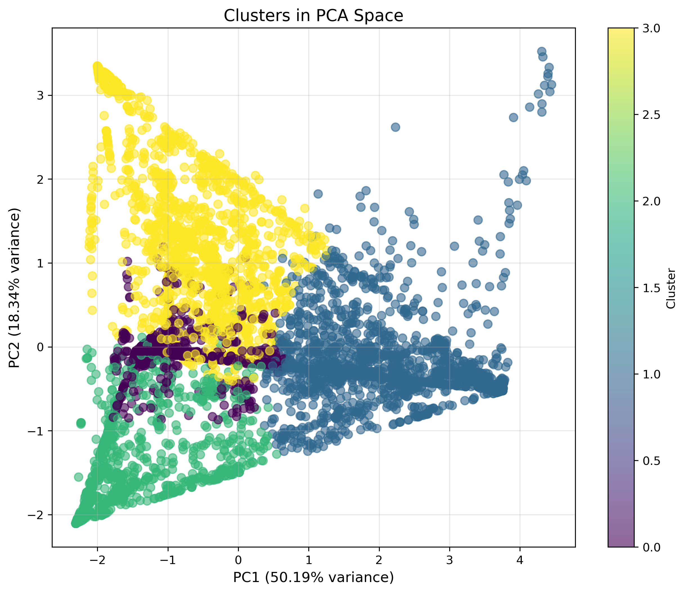
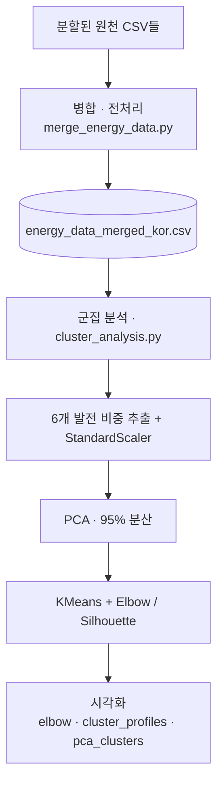

# 국가별 에너지 발전 믹스 군집 분석

전 세계 국가의 **발전원 구성(발전 믹스)** 데이터를 이용해 에너지 구조가 비슷한
국가들을 군집화하는 비지도 학습 프로젝트입니다.

## 데모



## 개요

화석연료·가스·수력·저탄소·바이오연료·석탄 6개 발전 비중을 특성으로 사용해,
국가들을 발전 구조 관점에서 그룹으로 나눕니다. 차원 축소(PCA)와 KMeans 군집화를
적용하고, Elbow Method와 Silhouette Score로 적정 군집 수를 탐색합니다.

## 핵심 기능

- 여러 출처의 에너지 데이터 병합 및 전처리
- 발전 믹스 6개 비중 특성 추출 및 표준화(StandardScaler)
- PCA(누적 분산 95%)로 차원 축소
- KMeans 군집화 + Elbow / Silhouette 기반 군집 수 탐색
- 군집별 프로파일 및 PCA 2D 산점도 시각화

## 시스템 아키텍처



## 사용 특성 (발전 믹스 비중)

화석연료, 가스, 수력, 저탄소, 바이오연료, 석탄 발전 비중

## 기술 스택

- Python, scikit-learn (StandardScaler, PCA, KMeans)
- pandas, numpy
- matplotlib, seaborn (시각화)

## 담당 범위 (팀 프로젝트)

- 팀 공동 작업 프로젝트입니다. 데이터 병합·전처리부터 차원 축소·군집화·시각화까지
  팀원들과 함께 진행했습니다.

## 실행 방법

```bash
pip install -r requirements.txt

# 1) 원천 데이터 병합
python merge_energy_data.py

# 2) 군집 분석 실행 (차트 이미지 생성)
python cluster_analysis.py
```

> 에너지 데이터셋(CSV)과 모델 파일(`.pkl`)은 용량 문제로 저장소에서 제외되어 있습니다.
> 원천 데이터는 공개 에너지 통계(예: Our World in Data 계열)를 기반으로 하며,
> `merge_energy_data.py` 의 파일 경로에 맞춰 배치한 뒤 실행합니다.

## 디렉터리 구조

```
energy-cluster-analysis/
├── merge_energy_data.py     # 분할 CSV 병합·전처리
├── cluster_analysis.py      # PCA + KMeans 군집 분석
├── elbow_analysis.png       # Elbow / Silhouette 결과
├── cluster_profiles.png     # 군집별 프로파일
├── pca_clusters.png         # PCA 2D 군집 산점도
└── requirements.txt
```

## 알려진 한계 / 향후 계획

- 군집 결과의 해석(각 군집이 어떤 에너지 정책 유형인지)을 정성적으로 더 보강할 수 있습니다.
- 연도별 변화 추이를 반영한 동적 군집 분석은 향후 확장 과제입니다.
