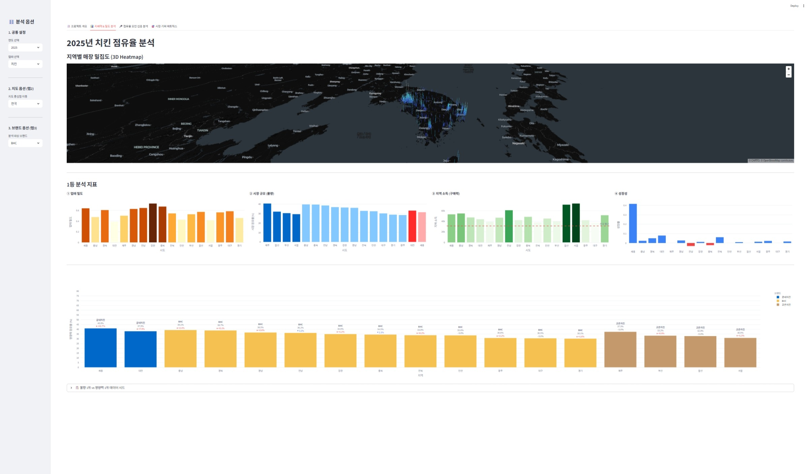
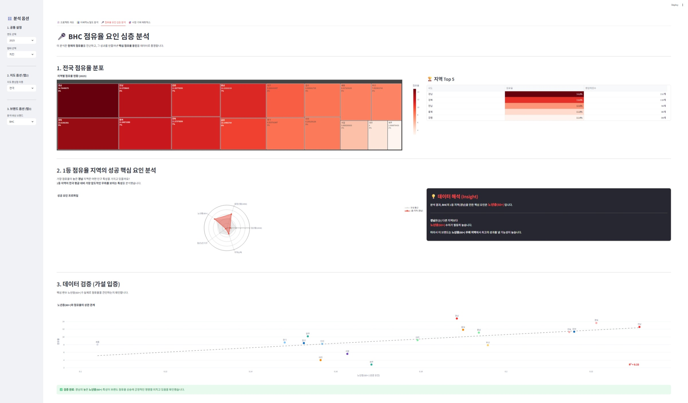
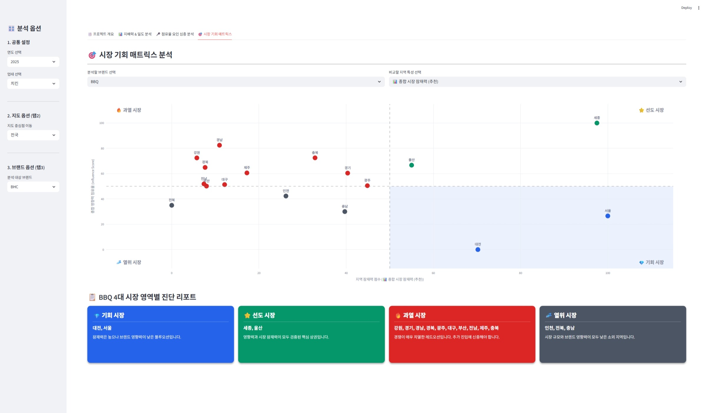

# 프랜차이즈 상권 통합 분석 대시보드

공공데이터 기반 프랜차이즈 가맹점 데이터를 지역·업태·브랜드별로 분석하고,
시장 기회를 한눈에 파악할 수 있도록 만든 Streamlit 대시보드입니다.

## 데모

**탭 1 — 지배력 & 밀도 분석**: 지역별 점유율과 3D 매장 밀집도(pydeck), 점유율 지표 차트



**탭 2 — 성과 요인 심층 분석**: 브랜드 전국 점유율 분포, 1등 지역 성공 요인 레이더, 회귀 기반 가설 검증



**탭 3 — 시장 기회 매트릭스**: 잠재력 × 점유율 사분면(기회/선도/과열/열위) 진단 리포트



## 개요

전국 프랜차이즈 가맹점 현황 데이터를 가공해, "어느 지역에 어떤 브랜드가 강한가",
"성과가 좋은 지역의 공통점은 무엇인가", "앞으로 어디에 진입해야 하는가"를
세 가지 관점의 탭으로 나누어 분석합니다.

## 핵심 기능

대시보드는 세 개의 탭으로 구성됩니다.

1. **지배력 & 밀도 분석** — 선택한 연도·업태의 지역별 점유율과 매장 밀집도를
   `pydeck` 지도(HexagonLayer)와 `plotly` 차트로 시각화합니다.
2. **성과 요인 심층 분석** — 특정 브랜드의 전국 점유율 분포, 1등 지역의 특성(레이더 차트),
   그리고 `LinearRegression`을 이용한 "점유율 ↔ 성과 지표" 가설 검증을 제공합니다.
3. **시장 기회 매트릭스** — 시장 잠재력과 브랜드 점유율을 두 축으로 하는 사분면
   (기회 / 선도 / 과열 / 열위)으로 지역을 분류해 진입 전략 인사이트를 도출합니다.

## 시스템 아키텍처

```
원천 CSV (가맹점 현황 + 좌표)
        │
        ▼
전처리 / 좌표 변환 (EPSG:5174 → EPSG:4326)   ← exploration/ 스크립트
        │
        ▼
franchise_analysis_corrected.csv  /  merged_result.csv
        │
        ▼
Streamlit 대시보드 (app.py)
   ├─ 탭1: pydeck 지도 + plotly 점유율 차트
   ├─ 탭2: 브랜드 심층 분석 + 회귀 가설 검증
   └─ 탭3: 시장 기회 사분면 매트릭스
```

## 기술 스택

- Python, Streamlit
- pandas, numpy
- plotly, pydeck (지도 시각화)
- pyproj (좌표계 변환)
- scikit-learn (LinearRegression)

## 설계 하이라이트

- 한국 공간데이터 좌표계(EPSG:5174)를 위경도(EPSG:4326)로 변환해 지도 위에 매장을 표시합니다.
- 연도·업태·브랜드를 사이드바에서 선택하면 세 탭이 동일한 필터를 공유해 일관된 분석 흐름을 유지합니다.
- 단순 현황 나열을 넘어, 사분면 매트릭스로 "진입 우선순위"라는 의사결정 관점을 제공합니다.

## 담당 범위 (팀 프로젝트)

- **데이터 수집 · 전처리**: 팀 공동 작업
- **그 외 대부분 본인 담당**: 좌표계 변환, 지도/차트 시각화, 회귀 기반 가설 검증,
  시장 기회 사분면 로직, 최종 통합 대시보드(`app.py`) 구현

## 실행 방법

```bash
pip install -r requirements.txt
streamlit run app.py
```

> 실행에는 `franchise_analysis_corrected.csv`, `merged_result.csv` 가 같은 폴더에 필요합니다.
> 두 파일은 용량 문제로 저장소에서 제외되어 있으며, 원천 공공데이터를 `exploration/` 의
> 전처리 스크립트로 가공해 생성합니다.

## 디렉터리 구조

```
franchise-analysis/
├── app.py              # 최종 통합 대시보드 (Streamlit)
├── dashboard.html      # 정적 산출물
├── picture/            # 대시보드 실행 화면 스크린샷 (3개 탭)
├── ppt_intro.png       # 발표 자료 이미지
├── ppt_data.png
├── requirements.txt
└── exploration/        # 데이터 수집·전처리·차트 실험 스크립트
```

## 알려진 한계 / 향후 계획

- 전처리 파이프라인이 `exploration/` 의 여러 스크립트로 흩어져 있어, 단일 진입점으로 정리할 여지가 있습니다.
- 데이터 갱신이 수동 과정이라 자동화(스케줄링)가 향후 개선 과제입니다.
