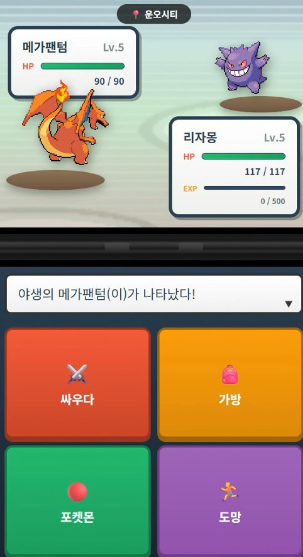
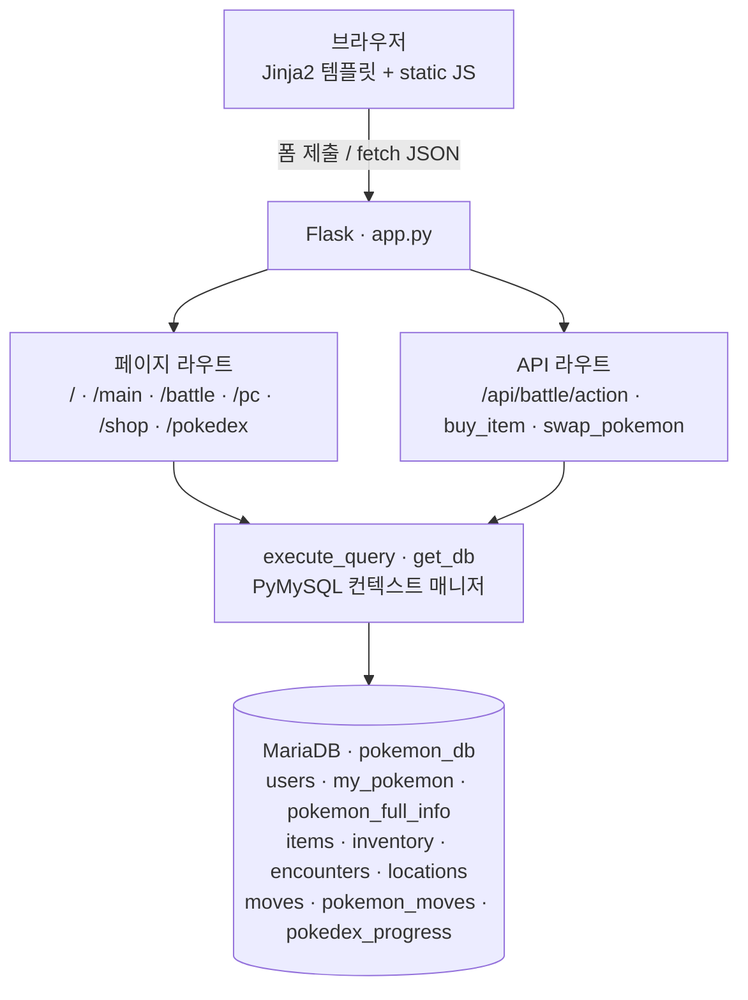

# 포켓몬 던전 웹게임 (Flask + MariaDB)

MariaDB를 백엔드로 사용하는 웹 기반 포켓몬 던전 게임입니다.
스타터 선택부터 던전 탐험, 야생 포켓몬 배틀·포획, 상점, 도감까지의 흐름을
Flask 서버와 SQL 데이터 모델로 구현했습니다.

## 데모

배틀 화면 — 야생 포켓몬과의 전투(싸우다 / 가방 / 포켓몬 / 도망)



발표 자료: [데이터베이스 설계 슬라이드 (PDF)](./docs/sql.pdf)

## 개요

플레이어는 스타터 포켓몬을 고른 뒤 층(floor)을 올라가며 야생 포켓몬과 배틀합니다.
배틀에서 이기면 경험치·돈을 얻고, 몬스터볼로 포켓몬을 포획해 도감을 채웁니다.
상점에서 아이템을 구매하고, PC에서 파티를 관리할 수 있습니다.

## 핵심 기능

- **스타터 선택 & 새 게임**: 사용자 생성, 기본 아이템 지급, 스타터 스탯/기술 초기화
- **던전 진행**: 현재 층에 매핑된 지역에서 야생 포켓몬 조우, 10층마다 보너스
- **배틀 시스템**: 물리/특수 데미지 공식, 반격, 경험치·레벨업·도감 등록 (`/api/battle/action`)
- **포획**: 잔여 HP 기반 포획률 계산, 몬스터볼 소모
- **상점 / 인벤토리**: 아이템 구매·차감
- **PC**: 파티 ↔ 보관함 포켓몬 교체 (파티 최대 6마리)
- **도감**: 본 포켓몬 / 잡은 포켓몬 진행도 추적

## 시스템 아키텍처



## 기술 스택

- Python, Flask
- PyMySQL (MariaDB 연결), DictCursor
- python-dotenv (환경설정)
- Jinja2 템플릿, 정적 HTML/CSS/JS 프론트엔드

## 설계 하이라이트

- `get_db()` 컨텍스트 매니저와 `execute_query()` 헬퍼로 DB 연결/커밋/조회 처리를 일원화
- 배틀·상점·교체 등 상태 변경은 트랜잭션(`commit`) 단위로 처리
- 설정 값(DB 접속 정보, Flask 시크릿)을 `.env` 로 분리 (`config.py` 에서 로드)

## 담당 범위 (팀 프로젝트)

- **DB(스키마/데이터)**: 팀 공동 작업
- **그 외 대부분 본인 담당**: Flask 라우팅, 배틀/포획 API 로직, 상점·PC·도감 기능,
  프론트엔드(템플릿·정적 자원) 구현

## 실행 방법

```bash
pip install -r requirements.txt

# 1) 환경 변수 설정
cp .env.example .env        # 이후 DB 접속 정보를 본인 환경에 맞게 수정

# 2) 데이터베이스 스키마 + 시드 데이터 import
mysql -u root -p < schema/pokemon.sql

# 3) 서버 실행
python Run.py               # 또는: python app.py
```

서버 기본 주소는 `http://localhost:5000` 입니다.

> **DB 준비**: 게임은 `pokemon_db` 데이터베이스를 전제로 동작합니다. `schema/pokemon.sql` 에
> 테이블 구조와 포켓몬 도감·기술·아이템 등 시드 데이터가 모두 포함돼 있어, 위와 같이 import 한
> 뒤 실행하면 됩니다. (추가로 `Init_db.py` 로 기본 아이템 시드를 넣을 수도 있습니다.)

## 디렉터리 구조

```
pokemon-web-game/
├── app.py            # Flask 앱 (라우트 + API)
├── Run.py            # 환경 점검 후 서버 실행 진입점
├── config.py         # .env 로드 / DB·Flask 설정
├── db_utils.py       # DB 연결 점검 유틸
├── Init_db.py        # 테이블 확인 + 기본 아이템 시드
├── manage_db.py      # DB 관리 스크립트
├── schema/           # DB 스키마 + 시드 데이터 (pokemon.sql)
├── docs/             # DB 설계 발표 자료 (PDF)
├── picture/          # 게임 플레이 스크린샷
├── templates/        # Jinja2 템플릿 (start/main/battle/pc/shop/pokedex)
├── static/           # css / js / images
├── requirements.txt
└── .env.example
```

## 알려진 한계 / 향후 계획

- 초기 구동에 `schema/pokemon.sql` import가 필요합니다(자동 마이그레이션 도구는 없음).
- 인증이 세션 기반 단순 구조라, 실제 서비스 수준의 계정/보안 처리는 향후 개선 대상입니다.
