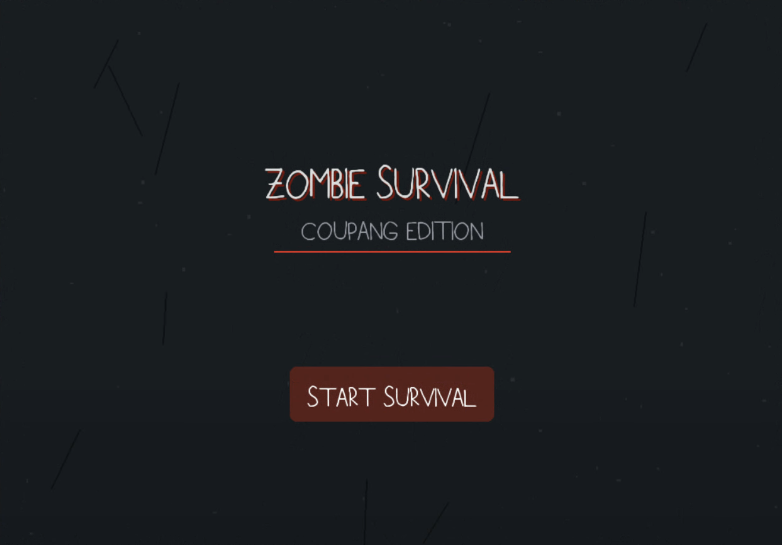
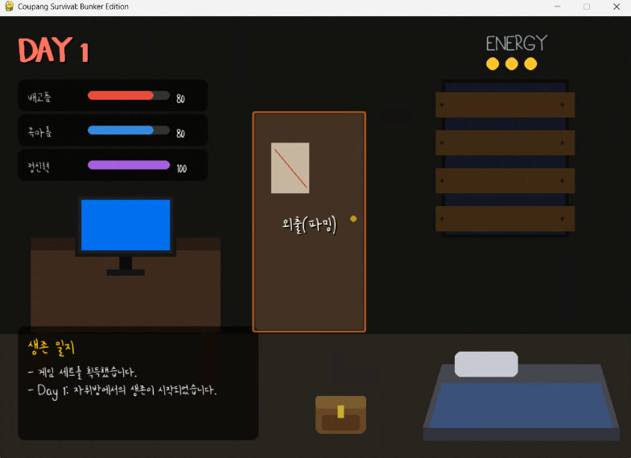
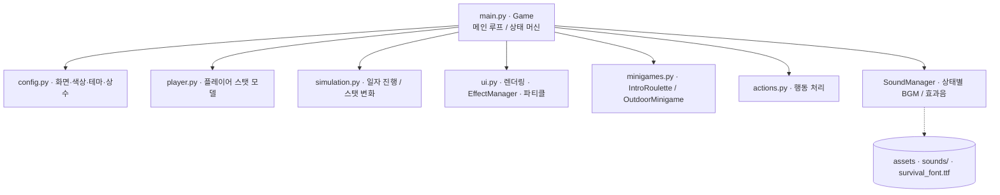

# Coupang Survival: Bunker Edition

좀비 아포칼립스 상황에서 벙커에 갇힌 생존자를 조작해, 한정된 자원으로
하루하루 버티는 pygame 기반 생존 시뮬레이션 게임입니다.

## 데모

타이틀 화면 — *Zombie Survival: Coupang Edition*



DAY 1 벙커 홈 — 배고픔·목마름·정신력·에너지 스탯 관리, 외출(파밍), 생존 일지



> 실행 시 상태별 BGM·효과음이 함께 재생됩니다.

## 개요

플레이어는 체력·수분·멘탈·에너지 네 가지 스탯을 관리하며 날짜를 넘깁니다.
'쿠팡' 콘셉트의 상점에서 보급품을 주문해 언박싱하고, 외출 미니게임으로 물자를
구하며, 자원이 바닥나지 않도록 매일 선택을 이어갑니다. 스탯이 위험 수준으로
떨어지면 심장박동 효과음이 재생되는 등 긴장감을 주는 연출을 넣었습니다.

## 핵심 기능

- **스탯 생존 루프**: 체력 / 수분 / 멘탈 / 에너지 관리, 날짜 전환(DAY_TRANSITION)
- **상태 머신**: TITLE → HOME → OUTSIDE / SHOP / INVENTORY 등 화면 상태 전환
- **상점 & 언박싱**: 보급품 주문 → 언박싱 연출 → 아이템 획득
- **미니게임**: 인트로 룰렛(IntroRoulette), 외출 미니게임(OutdoorMinigame)
- **사운드 연출**: 상태별 BGM 페이드 전환, 저체력 심장박동 루프 등 (SoundManager)
- **연출 효과**: 화면 페이드/셰이크, 파티클, 팝업 등 UI 이펙트

## 시스템 아키텍처



## 기술 스택

- Python, pygame
- 자체 상태 머신 기반 게임 루프
- pygame.mixer 사운드 시스템 (BGM/SFX, 페이드)

## 설계 하이라이트

- 화면을 문자열 상태(`TITLE`, `HOME`, `OUTSIDE`, `SHOP` …)로 관리하는 상태 머신 구조
- 에셋 경로를 실행 파일 기준 절대경로로 처리해 어느 위치에서 실행해도 사운드/폰트 로드
- 사운드 파일이 없거나 mixer 초기화에 실패해도 게임이 계속 동작하도록 방어적으로 로드

## 담당 범위 (팀 프로젝트)

- **일부 미니게임 · 플레이어 스탯 시뮬레이션**: 팀원과 협업
- **그 외 대부분 본인 담당**: 메인 게임 루프·상태 머신, UI·렌더링·이펙트,
  상점/언박싱 흐름, 사운드 매니저 구현

## 실행 방법

```bash
pip install -r requirements.txt
python main.py
```

> 실행에 필요한 사운드(`sounds/`)와 폰트(`survival_font.ttf`)는 저장소에 포함돼 있어
> 별도 준비 없이 바로 실행됩니다.

## 디렉터리 구조

```
zombie-survival-game/
├── main.py            # 메인 루프 / 상태 머신 / SoundManager
├── config.py          # 화면·색상·테마·상수
├── player.py          # 플레이어 스탯
├── simulation.py      # 일자 진행 시뮬레이션
├── ui.py              # 렌더링 / 이펙트
├── minigames.py       # 룰렛 / 외출 미니게임
├── actions.py         # 행동 처리
├── sounds/            # BGM / 효과음
├── survival_font.ttf
├── picture/           # 게임 화면 스크린샷
└── requirements.txt
```

## 알려진 한계 / 향후 계획

- 게임 진행 상태 저장/불러오기 기능은 없습니다(세션 단위 플레이).
- 밸런스(스탯 소모 속도, 상점 가격)는 향후 플레이 테스트로 조정할 여지가 있습니다.
